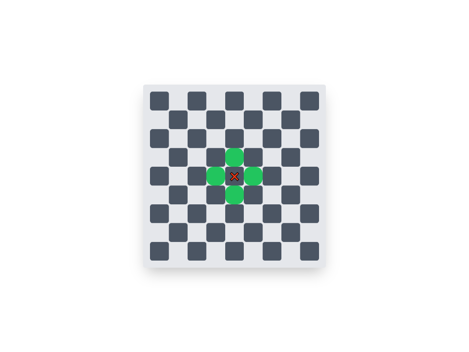

# Proyecto de Ajedrez con PHP y Tailwind CSS

Este proyecto es una práctica para generar un tablero de ajedrez utilizando PHP para la lógica y Tailwind CSS para el diseño. El tablero se representa en una página web, permitiendo visualizar las posiciones permitidas para mover una pieza de ajedrez, como un rook (torre), basándose en su posición actual en el tablero.La pieza de ajedrez en este proyecto se mueve una casilla a la vez, siguiendo las reglas clásicas del ajedrez. Esto significa que la pieza puede moverse horizontal o verticalmente.

