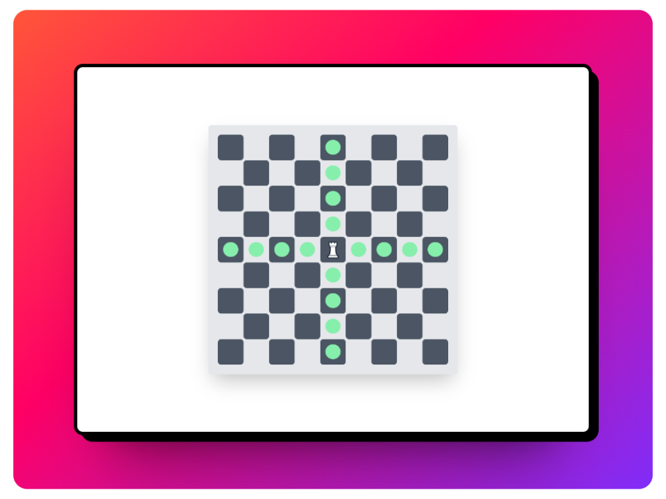

# Proyecto de Tablero de Juego con PHP y Tailwind CSS

Este proyecto es una práctica para generar un tablero de juego genérico utilizando PHP para la lógica y Tailwind CSS para el diseño. El tablero puede tener cualquier dimensión, como 9x9, 5x5, 8x3, etc y permite mover una pieza a través de él, una casilla a la vez.

